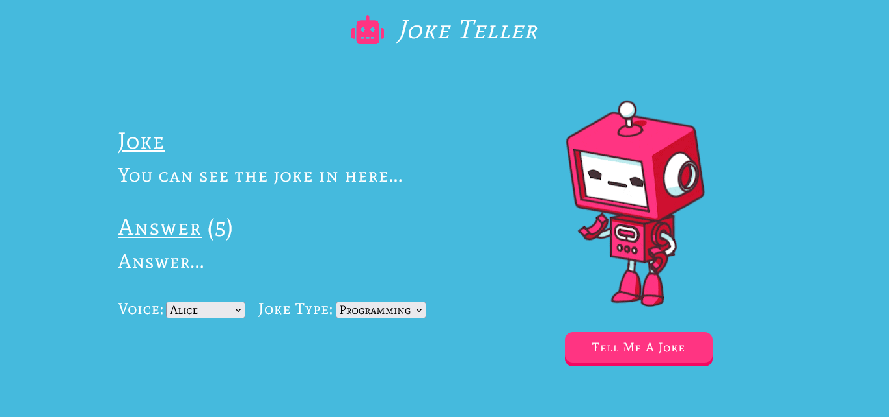

## Voice API

<li>You can check out <a href="http://www.voicerss.org/">this</a> website to find more information about voice API.</li>
<li>You can get your free API key from <a href="http://www.voicerss.org/registration.aspx">here</a> after registiration or you can use mine (it's in the script.js file).</li>

## Joke API

<li>You can check out <a href="https://jokeapi.dev/">this</a> website to find more information about joke API.</li>
<li>You do not have to register or do anything to use it, you can modify the http request according to the joke type you want.</li>

## Website

<li>You can visit the website from <a href="https://joketellerwebsite.netlify.app/">here</a>.</li>

## Images of Website

